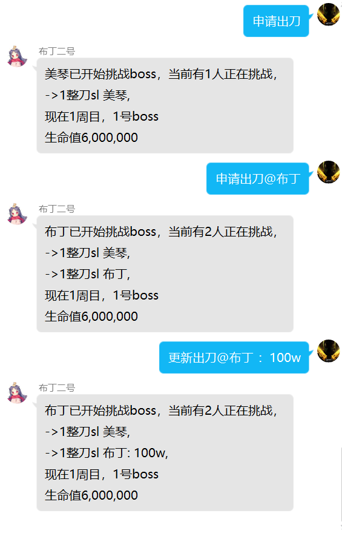

# yobot 项目改进版本，支持多人申请出刀（筛刀）

用于解决大家撞刀严重，群里发信息会被淹没，无法准确判断进入boss的人数等问题

只要群成员有使用`申请出刀`，`更新出刀`等习惯，出刀将变得流程化

**由于新版公会战规则变化，yobot无法适配新版公会战规则，请在下面时间之前改用[HoshinoBot Clanbattle V4](https://ngabbs.com/read.php?tid=26540003)**  
日服：2021年6月  
台服：2021年11月  
国服：2023年7月

[yobot](./about.md) 是为[公主连接](https://priconne-redive.jp/)公会战设计的辅助机器人，能够帮助公会战管理者提供自动化管理服务。

yobot 提供了群聊、web 页面两套用户交互方式，具有操作便捷、通知及时、数据详细的特点。

[主页](https://yobot.win)

[部署教程](https://yobot.win/install/mirai/)
[用户手册](https://yobot.win/usage/manual/)
[开源软件](https://yobot.win/project/open-source/)
[更新日志](https://yobot.win/project/changelog/)
[贡献者](https://yobot.win/project/contributors/)

## 开源协议

[本工具使用的开源软件和工具](./project/open-source.md)

使用本工具时请遵循[GPL-3.0 协议](https://www.gnu.org/licenses/gpl-3.0.html)，并在其基础上附加以下条款：

- 如果修改本工具源码并提供服务，不允许以本项目的名义中加入任何商业广告、诱导使用、引导关注等内容。
- 如果收费提供本工具，则必须在交易发生前，主动向客户介绍本开源工具。
- 不得移除项目网页中“powered by yobot”的字样和超链接

## 支持多人出刀版

`申请出刀`指令不再只能一人使用，可以多人同时申请，并且提供出刀状态的的显示，报刀后自动解除申请等等，使用指令如下

- `申请出刀[@某人]`：自己或某人进入正在出刀状态，加入正在出刀的序列
- `取消申请[@某人]`：自己或某人解除正在出刀状态，退出正在出刀的序列
- `状态`：显示正在出刀的人和其留言，当前boss信息，锁定信息等
- `锁定：留言`：管理权限，锁定当前boss，是的之后申请出刀都不能通过
- `更新出刀[@某人]：留言`：给自己或某人的出刀状态留言，并在之后别人使用`状态`指令时显示，可以留言自己的伤害，是否是补偿刀等等，随便留
- `解锁`：管理权限，解除当前boss的锁定状态
- `挂树[：留言]`：就挂树了，并且在自己的出档状态上新增"寄 + 留言"等信息
- `sl`或`SL`：解除当前的正在出刀的状态
- `查刀@某人`：查询他出了几刀，是否使用了sl

2021.10.03 加入刀数显示 显示`第几刀` 是否为`补偿` 是否还有`sl`

2022.01.14 加入`查刀@某人`，查询这个人的出刀情况

2022.05.26 更新jscdn

2022.09.21 cdn文件上传

使用演示

显示信息分别为：`第几刀` ，`是否是补偿刀`，`有无sl`，`昵称`，`更新的信息`

筛刀

查刀

